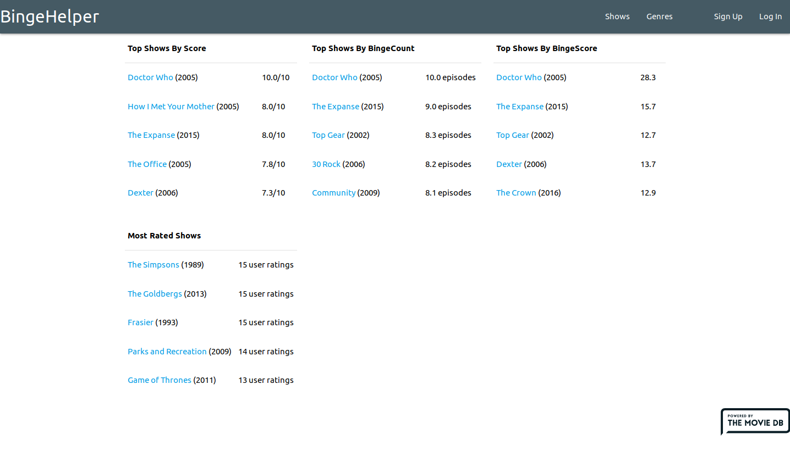
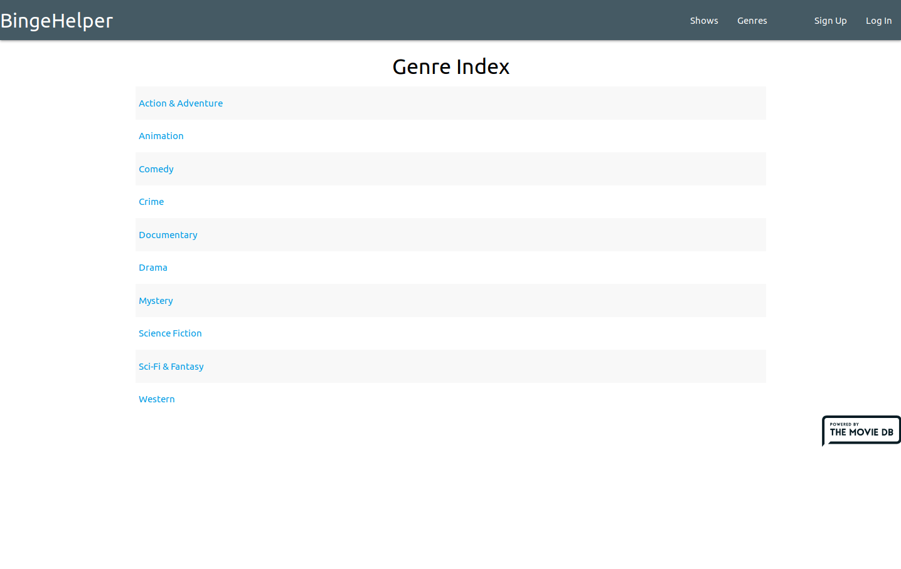
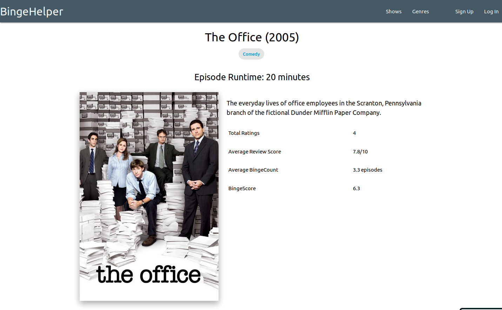

# BingeHelper

[Live Link](https://bingehelper.herokuapp.com)

## Table of Contents

* [Description](#description)
* [Requirements](#requirements)
    * [System Requirements & Dependencies](#system-requirements--dependencies)
    * [Application Requirements](#application-requirements)
* [Installation](#installation)
    * [Default Admin Details](#default-admin-details)
* [Contributors](#contributors)
* [Screenshots](#screenshots)
        * [Home Page](#home-page)
        * [Genre Page](#genre-page)
        * [Show Page](#show-page)

## Description

This application was a self-directed student project. Its purpose is to create
an site that users could register for and give two types of ratings on their
favorite TV shows. The first rating is a standard rating 1-10 for overall
quality.

The second rating is for how much a user enjoyed the show in terms of how many
episodes on average they watched during a session.

These two scores, along with other data, combine to form a BingeScore. A BingeScore
rating determines who "bingeworthy" a TV show is.

## Requirements

### System Requirements & Dependencies

* [Ruby](https://www.ruby-lang.org/en/) >= 2.4.0
    * [Bundler](https://rubygems.org/gems/bundler)
* [PostgreSQL](https://www.postgresql.org/)
* [Rails](https://rubyonrails.org/) >= 5.0

### Application Requirements

This application requires the use of an API key from [The Movie DB](https://www.themoviedb.org/).
See the steps below on setting up this application locally.

## Installation

1. Register and receive an API key from [The Movie DB](https://www.themoviedb.org/?language=en-US)
1. Run `git clone git@github.com:mikecm1141/bingehelper.git` in your terminal
1. Change directory into `bingehelper`
1. Run `bundle install` to install dependencies
1. Create and open File: `<app_directory>/config/application.yml`
1. Insert `API_KEY: <YOUR_MOVIE_DB_API_KEY_HERE>` into `application.yml` and save
1. Run `rails db:{create,migrate,seed}` to initiate database with starting seeds
1. Run `rails server` and visit the application at `http://localhost:3000`

### Default Admin Details

By default, the database is seeded with an admin account available for use.

`email: admin@admin.com`
`password: password`

## Contributors

This was a solo project by the repository owner, Mike McKee.

## Screenshots

#### Home Page

---

#### Genre Page

---

#### Show Page

---
